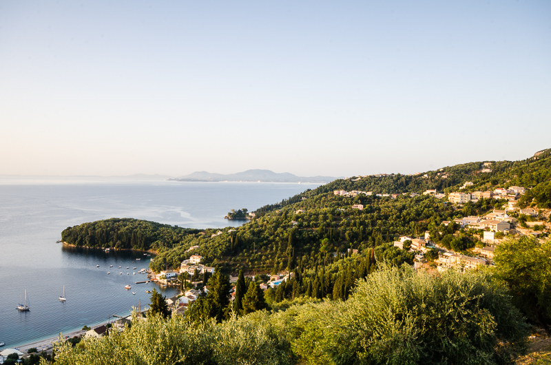
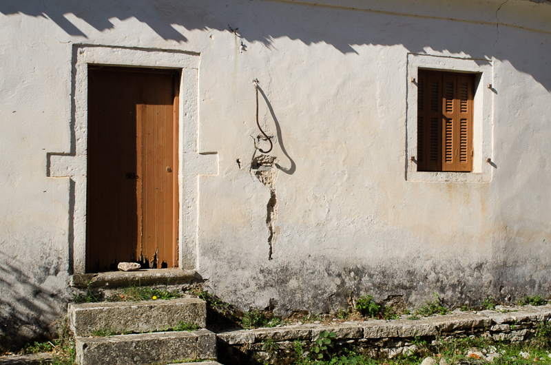
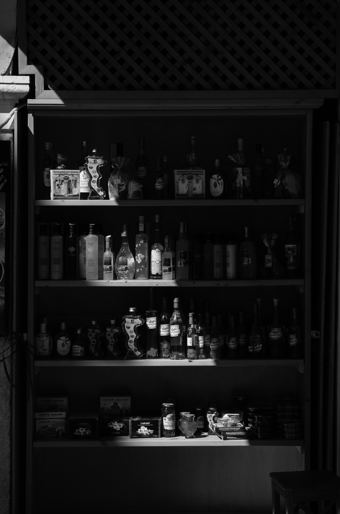
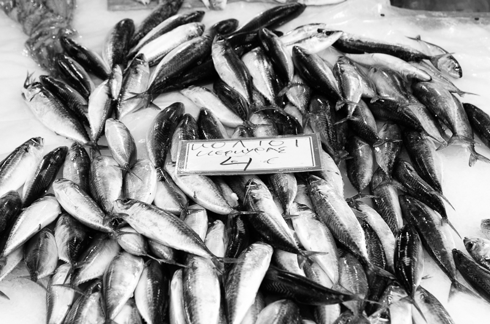

I hope you all had a fabulous Christmas and New Years Eve? We certainly had a great time and now I am eager to get my teeth into the new year and to eat no more chocolate at least until Easter!!

2017 was a good year, we visited some great places and they will stick on our memories for a long time to come. Two particular trips stand out in my mind and they were our trip to Wales in June followed by a two week holiday in Corfu during September.

I am going to share a few photos here but some I am going to hold back to share in their own posts over the next couple of months. I like to do a retrospective during the Winter months, as I don't get out with the camera as much as I would like.

2017 was also the year of the drone, I got some flights in and some good footage - more of that to come in 2018.

## Locally...
### Up on the rooftops

During the Autumn of 2017, Tina and I visited the Vyne in Hampshire which is close to the town of Basingstoke. The Vyne is a National Trust property and they have been undertaking a major roof renovation project and for the first time ever have allowed the general public to take a look. So we found ourselves climbing up a temporary staircase to the scaffolding rig that currently encases the entire property.

It was a real treat because we were able to see the rooftop of the building in such great detail, it was truly fascinating. You could see the layers of history being taken apart for the installation of fire protection and some repair work. In the photo below you can see where they have removed the old tiles, to expose the original beams of the property.

## Corfu, Kassiopi
### The Greek Churchyard

I am working backwards in time for this article, no real reason, apart from the simple fact I am working through the 'pictures' folder on my Mac!

Corfu was lovely, I loved it and want to return as soon as we possibly can. We stayed at Kalami and visited the nearby harbour town of Kassiopi which we adored and visited practically every day, as there was a good circular walk we could do there which we repeated as part of our morning or evening routine. Quite often!

This Church was simple in style and we never went inside but you could cut through the yard to reach another street. The light was spot on for this shot, I especially loved the gentle backlighting on the foreground vine. It cast such delicate shadows.

### The view of Albania

We stayed at a stunning villa in Kalami with a view that we shall never forget, it was unbeatable, you could see not only the entire eastern coast of Corfu, sweeping out towards the port of Corfu Town on the horizon but the Albanian coast was so close, you could almost reach out and touch it.

We often got up early and in the case of this shot, it was just before 6am. I made use of my Gorillapod and a couple of ND grad filters to capture this scene whilst supping on a strong local coffee. Yes, this was taken from the pool terrace of the Villa, not bad hey?!

### The view of Kalami

A little later as the sun had pretty much risen behind me, I took this photo from the same spot as the previous picture in this article, just a little bit later, though probably on 20 minutes or so later. The sun does come up fairly fast and the temperature rises quickly. I can picture that warmth on my back as I write this wearing a wooly jumper in my office (the heating in here as only just come on).

A little bit of history for you:

The houses just at the base of the little headland that is sticking out were the home of the Durrell family back in the 1930's and was made popular in the novel written by Gerald Durrell, "My family and other animals". One of the buildings is called the "White House" and belonged to the highly successful writer Lawrence Durrell. It is now a holiday rental property and restaurant. We ate there a couple of times and whilst not the cheapest of places to eat, the food is very good. I had a "Stifado" there which is a game based dish comprising of venison stew, onions, red wine (lots) and cinnamon.

### Old Perithia

I am going to come back to write about Old Perithia in an article of it's own as it is such a fascinaing place. To give you a quick introduction, it is high in the mountains of Corfu, miles away from anywhere and is deserted. Having said that people are starting to restore the old town to make it inhabitable again. There are a couple of places to eat and drink there but otherwise, you step back in time to another era and it is quite a magical place.

### Corfu Town

Corfu Town has so much to offer, that I feel as if we could stay there a week some time in the future to explore every nook and cranny. We visited twice and it is a lively place with hundreds of shops. Great place for leather products, I bought a very nice belt that I wear all of the time and Tina found a really funky handbag there. I am sure both the belt and the bag will last us for years, their quality is excellent.

