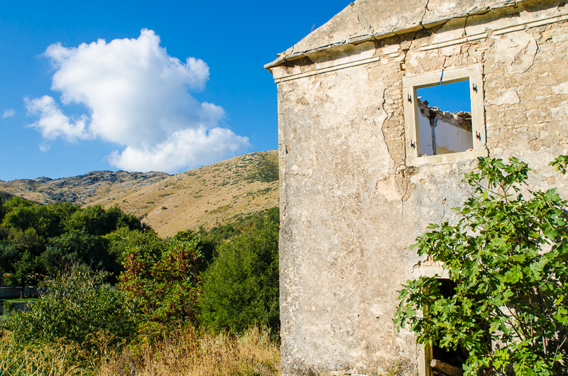
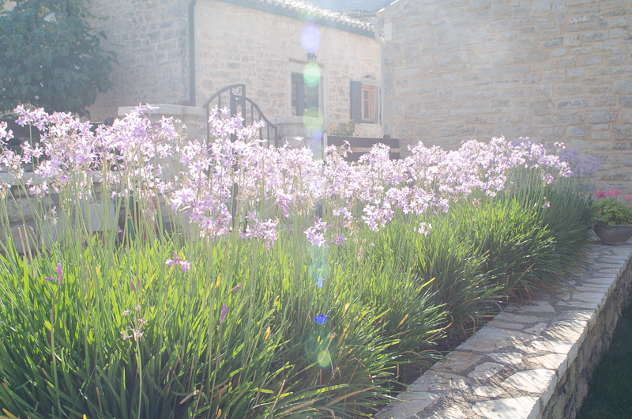
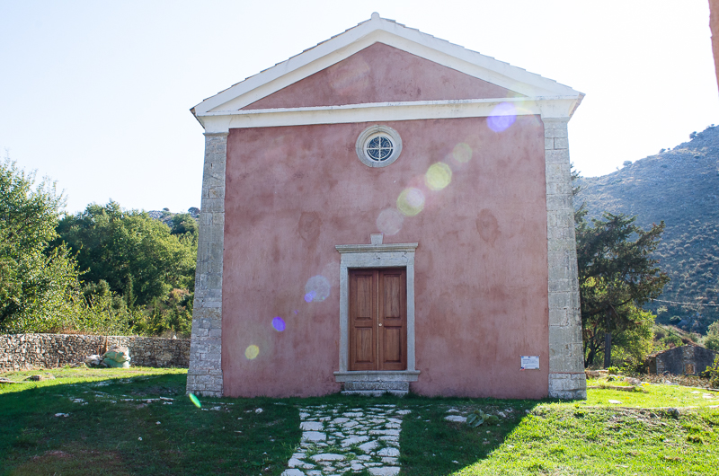
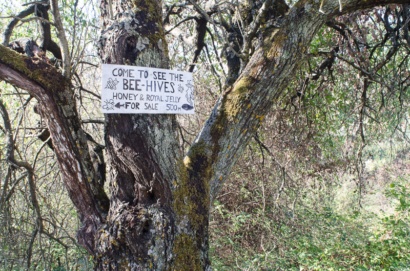
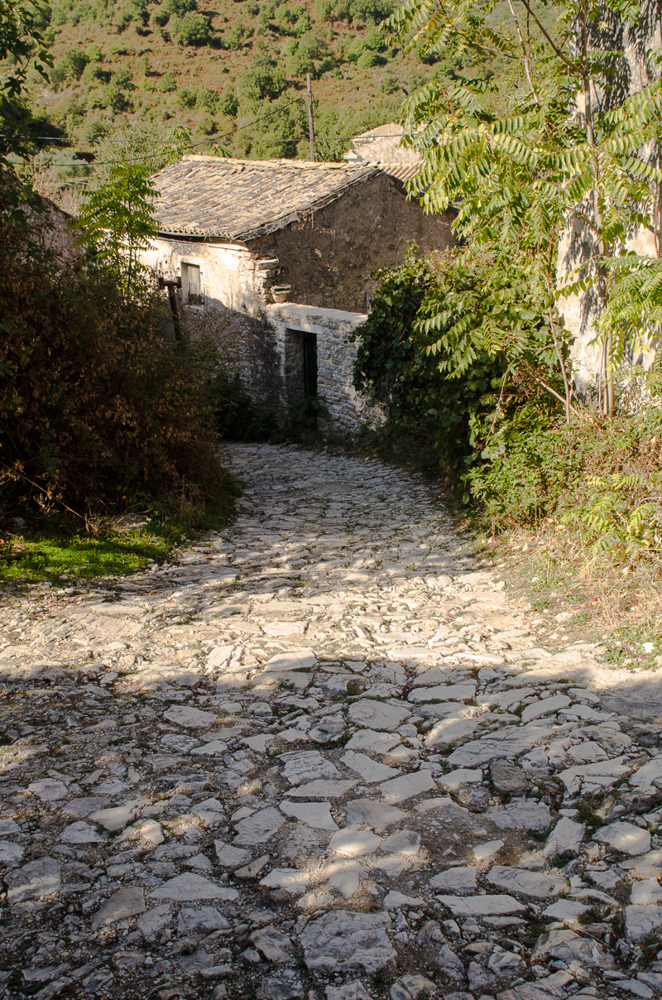
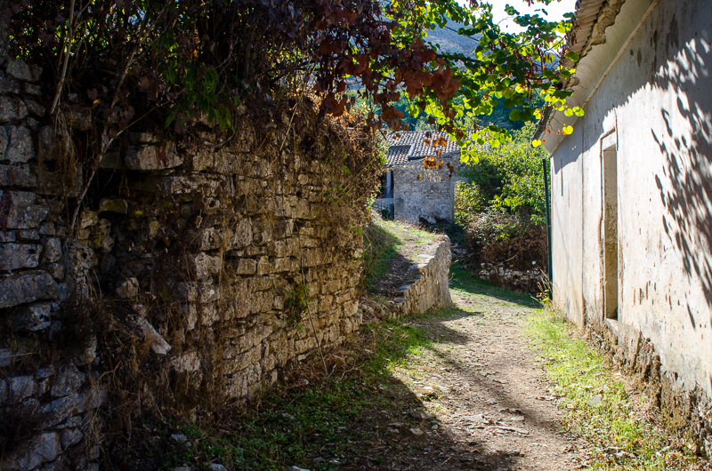
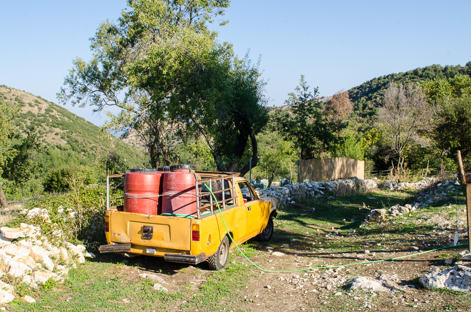
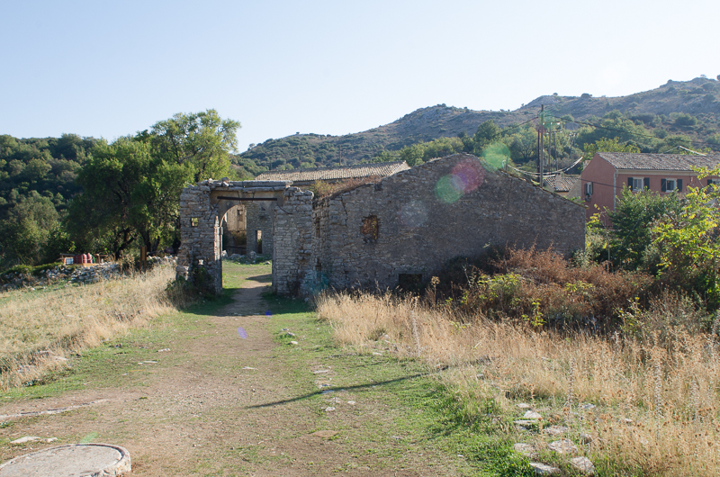
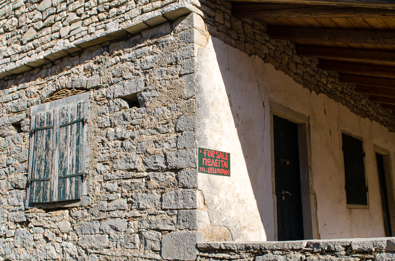

We left the comparatively sensible winding roads of the Corfu coast behind us and headed inland. I had noted that most such roads appeared to be vertical inclines that were somewhere in between being a track or an actual asphalted road. This one was not too bad to begin with and I must say the signage is generally very good in Corfu. We drove through tiny villages where the roads were just wide enough for a modern car to make it's way through. Animals roam freely, we came across chickens, hens, donkeys and plenty of idle farm dogs lolling around in the morning heat. It was still quite early and as such we practically had the roads to ourselves.

The roads remained sensible until we started to leave the villages behind us and they started to become steeper, very windy and very mountainous. I negotiated hairpin after hairpin, praying that nobody would come the opposite way. There were passing points but many of them were right on the edge of a sheer drop. Some parts of the road were protected by crash barriers and others weren't.

One of the things I love about a mountain road is the way everything changes quickly as you climb upwards. The bottom of the road was bordered by steep pine forests and obligatory olive groves. However now we were driving through a more barren landscape, the ravages of a fairly recent fire could be seen, gnarled, petrified trees reaching out from the ground like tortured hands pointing to the sky.

We could now see the surrounding Mediterranean (Ionian) sea once again, the extent of Corfu stretching out to the South until we turned another corner, started climbing further up once more, we could now see Albania on the other side of the channel between the island and mainland. We felt as if we were on top of the World and we saw not a soul until we turned another bend and saw a couple of people preparing for a mountain hike. The dramatic coastline we had left behind earlier now seemed genteel by comparison.

All of a sudden the road petered out into a dust track and we caught glimpses of the old town we had been looking for. This was it. We parked the car and ventured out.

We had found Eden. There was not a sound other than the cacophony (I nice one that is) of bird song. In fact I was bowled over by the number of birds we saw flitting around from tree to tree. There was an abundance of wildlife and I respected the nearby sign that was written in English prohibiting the use of drones! I left mine in the car...

## The Church of Old Perithia

I don't know what the name of the Church is, have tried looking it up but have had no luck but since the site is a protected heritage site, it is currently not open to the public. Compared to the other buildings across the old town, it is the only one that is painted. It is quite possible all of the buildings were before Perithia was abandoned in the 1960's.

## Bee Hives & Greek Honey

Greece is well known for it's bitter tasting yogurt and the heavenly honey that you add to it. I have always been fond of this combination and Corfu is no different to other parts of Greece where you can find in the shops large tubs of yogurt and a shelf nearby crammed full of honey jars. I was amused by this sign, mainly because it was written in English much like the drone warning I had read as we arrived. This is because an Englishman purchased the old guest house some years ago and I must buy the book that tells the whole story. I came across this [article in the papers](http://www.independent.co.uk/travel/europe/old-perithia-corfu-abandoned-village-ghost-town-greece-off-radar-secret-travel-a7955811.html) that strangely was written just after we came back from Corfu!

## Ancient roads

Whilst we sat in a cafe drinking coffee I watched in amazement as someone drove an Audi TT down this cobbled road and wondered how far they had to go across such a bumpy road. Apparently there are never any more than 3 permanent residents in the town. Much of it is in ruins but some buildings have been carefully restored to become not just inhabitable but rather desirable. They aim to restore at least 80% of the town and I wonder how it will look in ten years time. I hope these old cobbled streets are untouched and their timeless charm maintained.

## In summary

We travelled to Corfu in September 2017 and it was still very warm albeit no longer as hot as it had been in the previous months of the summer. So we were able to walk around quite comfortably but the strength of the sun and the thinner air in locations like this can effect some people, I recommend taking water with you and to wear a hat! Not to mention sun block!

You can find out more about Old Perithia via the following links:

- [Why Corfu's ghost town is the island's best kept secret](http://www.independent.co.uk/travel/europe/old-perithia-corfu-abandoned-village-ghost-town-greece-off-radar-secret-travel-a7955811.html)
- [TripAdvisor](https://www.tripadvisor.co.uk/Attraction_Review-g189458-d2294853-Reviews-Old_Perithia-Corfu_Ionian_Islands.html)
- [Official site](http://www.old-perithia.com/)
