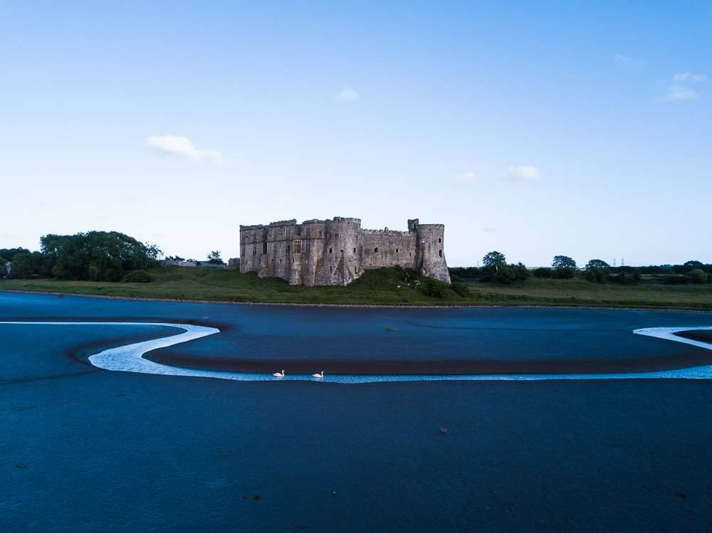
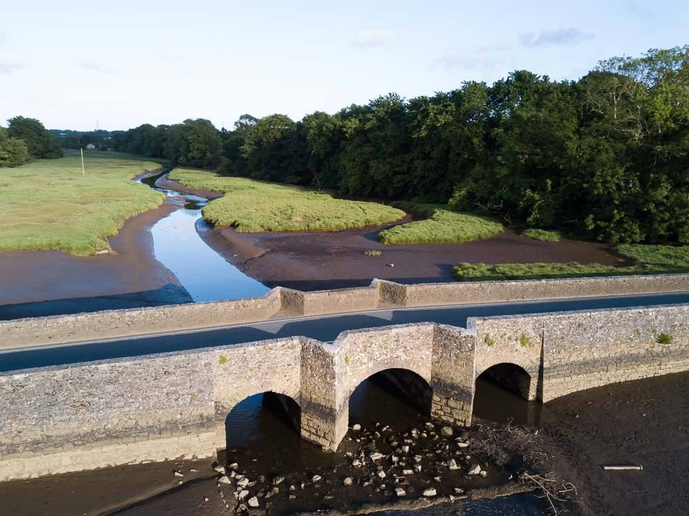
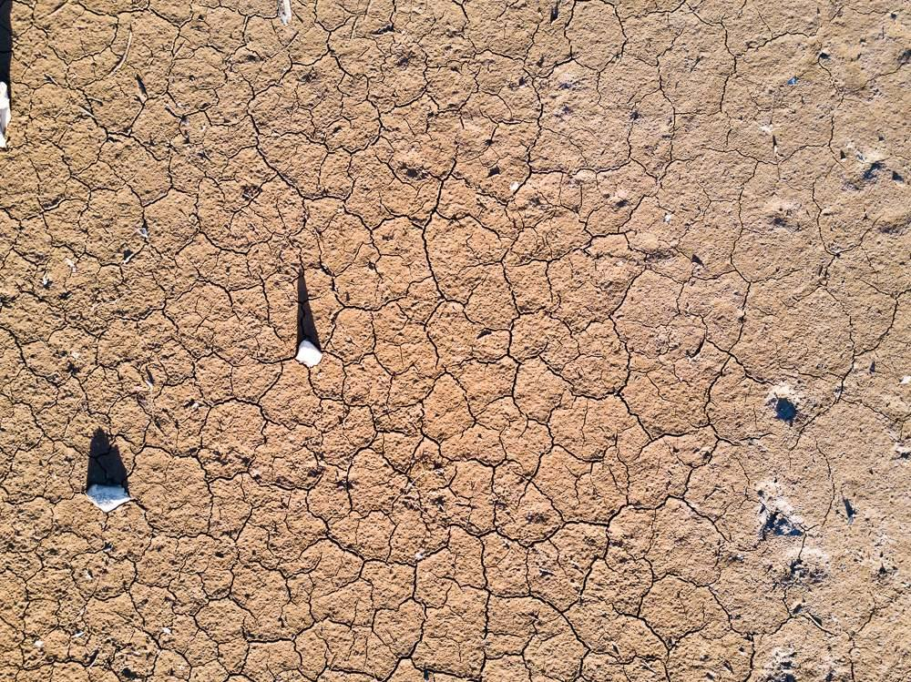

Drones have taken the world of aerial filming and photography by storm. There is hardly a programme on TV nowadays that doesn't feature at least some drone footage. I follow a number of talented photographers on Instagram who shoot nothing but drone photography.

So last year not long after I purchased the brilliant DJI Mavic, we went to Pembrokeshire. We had a fabulous time, despite the weather being very Welsh and explored as much as we could manage. No doubt I can write some more articles about this over the coming weeks, I've got some more photos to use.

Having unpacked our cars and made ourselves comfortable at the lovely Hilttop Farm Cottage near Martletwy, we decided to head for Carew Castle for an evening walk. It was literally just ten minutes down the road and what a beautiful place it is too.

The images here were all taken with the Mavic. The first image at the top of the page may not look much like an aerial photo and in fact I wouldn't class it as such but the photo was taken from about halfway across the river. I couldn't have walked there because the mud would have swallowed me up! I didn't notice the swans until after I downloaded the files from my card later that evening!

The next two photos were taken from a much higher vantage point, in both cases my drone was about 60ft up in the air.

The bridge shot is really cool because from the ground the view is impressive as it is but from this angle you get to see more detail and some reflections on the water too, that weren't obvious from the ground level.

The above shot was taken from the same location as the bridge photo and all I did was adjust the camera gimble to point straight down for this cool abstract shot. I shall be taking more of these in the future and in fact may use my a lot more for this kind of concept than shooting video sequences. We shall see what adventures 2018 brings...
