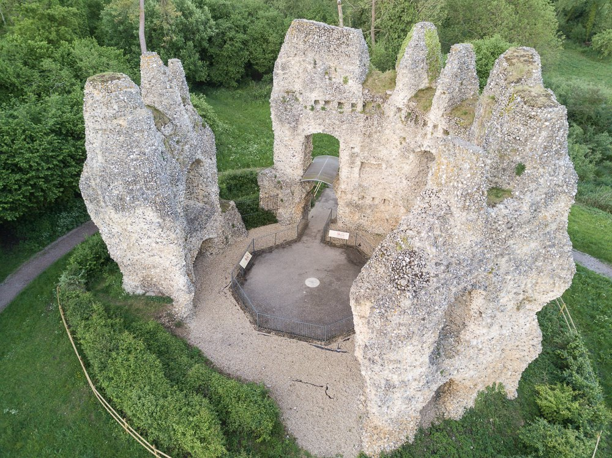

Last year I started to explore familiar places that were within no more than 30 minutes drive from my home. So I drew up a list of locations I could think of and then I checked them all against no-fly zones, in this case I was on the edge of one such zone, as I shall explain.

## King John's Castle (Odiham Castle)

Dating back to the 13th century, this castle was built for King John during his reign and it's site was probably chosen because it's a halfway point between Windsor and Winchester. King John would have frequently used the castle when travelling towards the South Coast. It probably played a part in the piece of history that was the Magna Carta, as King John either travelled from Odiham or Windsor to seal it.

Later it was captured by the French during a siege circa 1216 and then it is documented that it was recovered from the French and rebuilt over the 9 years that followed.

During the 15th century, Odiham Castle was used as a hunting lodge and by the time of the 16th century it was recorded as being a ruin. Later in 1792, the Basingstoke Canal was constructed to pass closely by the Castle. It hasn't changed an awful lot since this time. Though over the last tn years it has been renovated and is now looked after by English Heritage.

In the 1980's a young boy and his schoolmates used to take part in cross-country runs as part of their PE lessons, his name was none other than Nick Lewis and they would use the canal towpath as part of their route. We would often sneak off and explore the castle for a few minutes before carrying on to catch up with the other children. I remember those days with a mixture of nostalgia and slight pain, as I was never the sportsman but actually quite enjoyed the cross-country run. Robert May's School is still there, has changed a little bit since I was there and is still a good centre of education. 

We now live a bit further away but not too much, as we often drive there to take a walk along the Basingstoke Canal. It's beautiful spot with the water very clear in places, partly because of the feed from the River Whitewater which occurs very close to the Castle's location through a small weir.

## No-fly zones

I was able to fly here but only just because of the proximity to RAF Odiham and it was for this reason I chose to take a single aerial photograph and be done with it. So I was only flying for about 5 minutes...

## Attracting some interest

Even so.... a few people suddenly turned up and I was delighted to have conversation with them about the drone without the slightest hint of animosity towards what I was doing. I did of course show the people the photos I'd just taken and they were all very fascinated. One gentleman commented it's great to see someone with such a great interest for this old ruin. I then told him about my School stories and the cross-country run and he turned out to be a retired teacher but I think he had worked there before my time. 

Another man was out for a walk with his two dogs and his young son, who was really interested in the drone, asked lots of very good questions, almost as if he was thinking of getting one!

I headed home feeling great for having given some other people a new perspective.