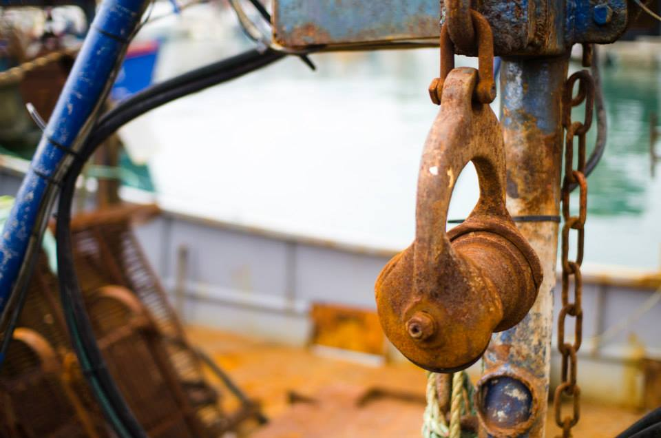
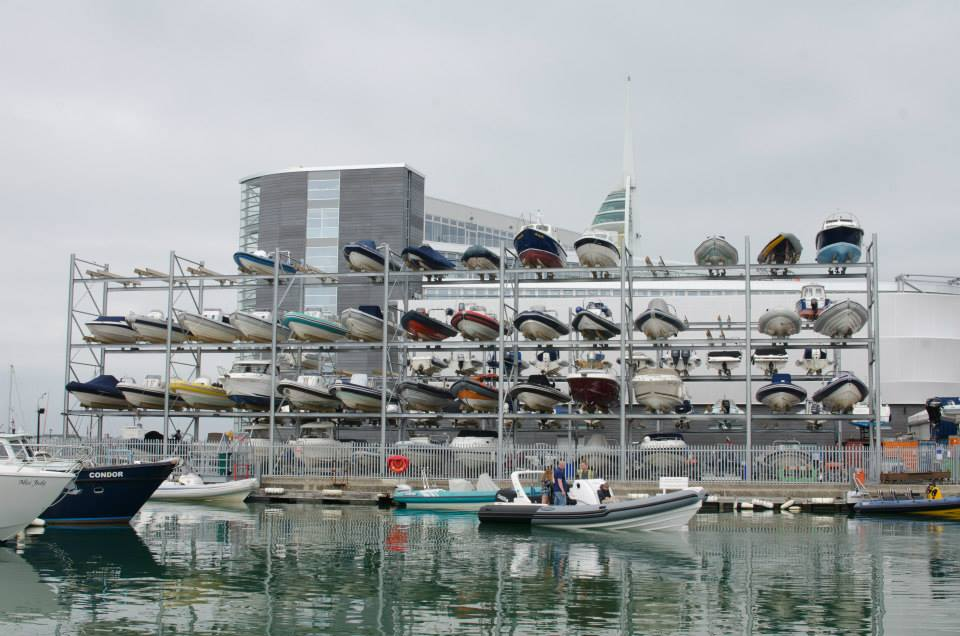
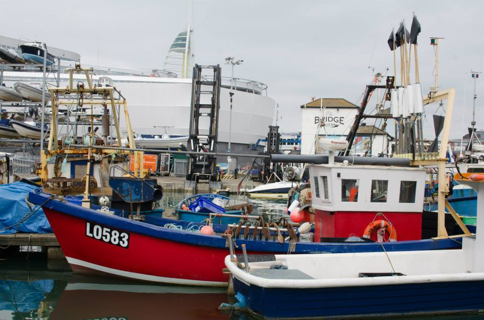

It's cold and murky outside these days, we have forgotten what the sun looks like and it is constantly 4 degrees celcius. Yes I am a British bloke and we like moaning about the weather, it keeps us amused during these months. So I decided to find some photos from a brighter and warmer time of year. Ah, hmmm, I found some from the same time of year around two years ago!

Mind you as you can see from the photo at the top of this page, dull overcast weather is ideal for abstract details. I always look out for this kind of thing and especially around docks. How about some fishing nets, a bit more colour to brighten up a grey day.

## I love Portsmouth

Portsmouth is a city that's located on an island that is joined to the mainland by a strip of land, it is quite unique in this respect. It is also an important town for it's naval history and still is the home of the British Naval Forces. It has a lot to offer people and is a great place to visit at any time of the year.

I have enjoyed exploring the city with my camera over time and that is something I plan to continue. In this post I am going to introduce you to a part of Portsmouth that is known as Camber Dock. We often walk past it when visiting because of where we tend to park. If you are planning a trip to Pompey, you will find Camber Dock is part of the area known as "Old Portsmouth" and is located just to the South of the Isle of Wight Ferry Terminal and Gunwharf Quays.

