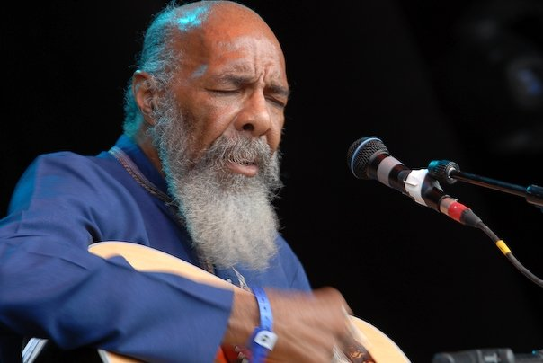

The legendary Richie Havens, who kicked off Woodstock 69 at short notice and made up his most famous song "Freedom" on the fly. I had nearly missed him at Guilfest, as I walked into the pit he came back onto play an encore and guess what he played - yes you got it- "Freedom".

Sadly he passed away in about 4 years later in 2013.

I will dig out more of these from my archives. Have a great weekend everyone!