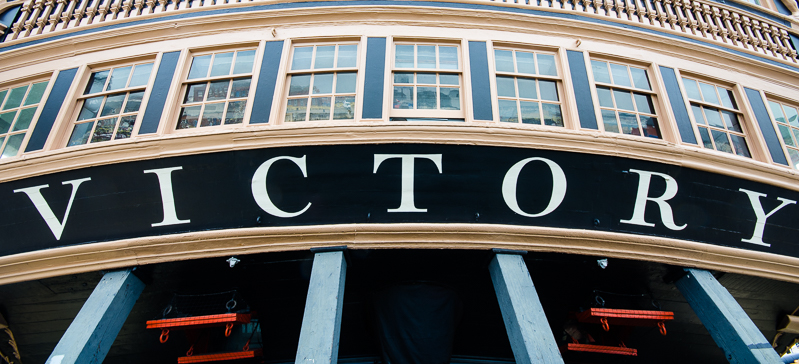
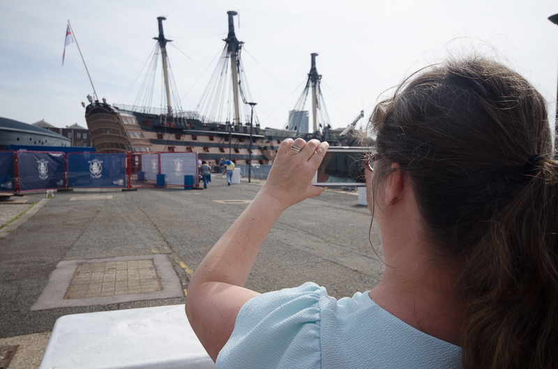
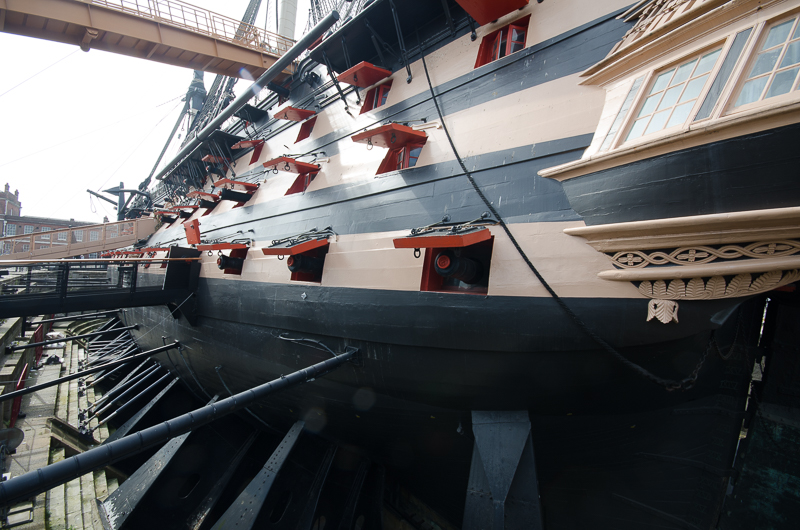
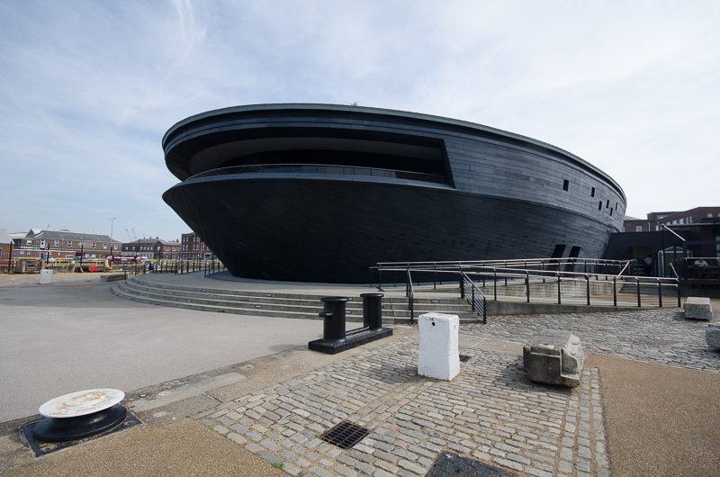
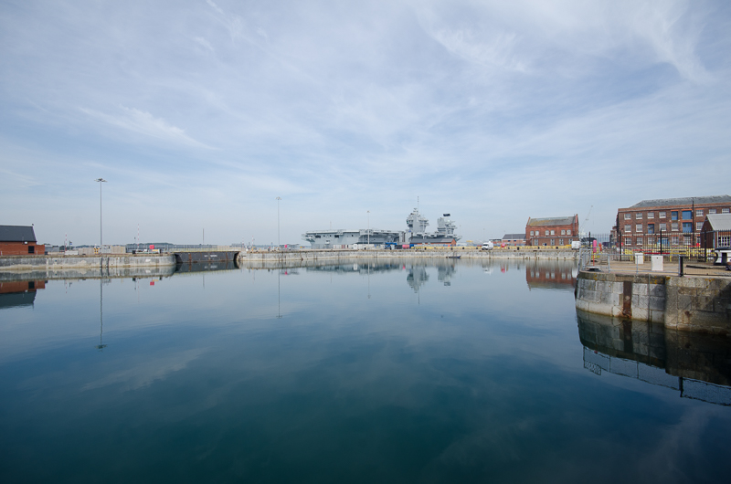
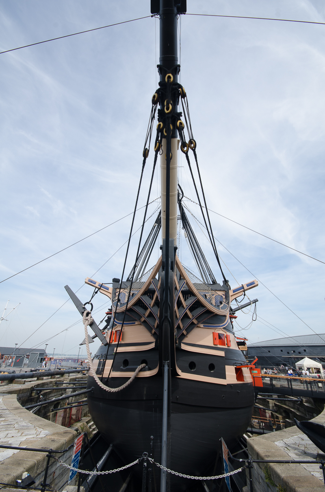
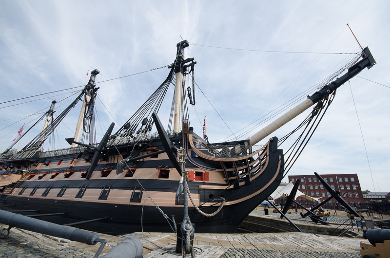

I highly recommend getting a year long pass for the Historic Dockyard at Portsmouth as it gives you access to everything for one single fee. One Summer morning we headed down to Portsmouth to see if we could find the new aircraft carrier, HMS Elizabeth which we did but couldn't get close enough to get a decent photo and I wish I had taken my 500mm lens. I often find there is one shot out of a bunch of so-so images that just works really well and for me it was the abstract that i share at the top of this article.

Here are some others from the same excursion.

My Wife Tina tkaing pictures...

HMS Victory

The Mary Museum is an amazing piece of architecture, if you've not been there, you should go, if you don't live in the UK, book a flight and come over. To me it looks like a giant barnacle and maybe that is the idea because after all the Mary Rose herself required a lot of cleaning and the display that has been created inside this fabulous building is perhaps one of the best museum displays in the world. We've been in there twice already.

Yes this is how close we got to the HMS Elizabeth, not very! My wide angle lens makes massive things seem tiny but I liked the water in the foreground though!

