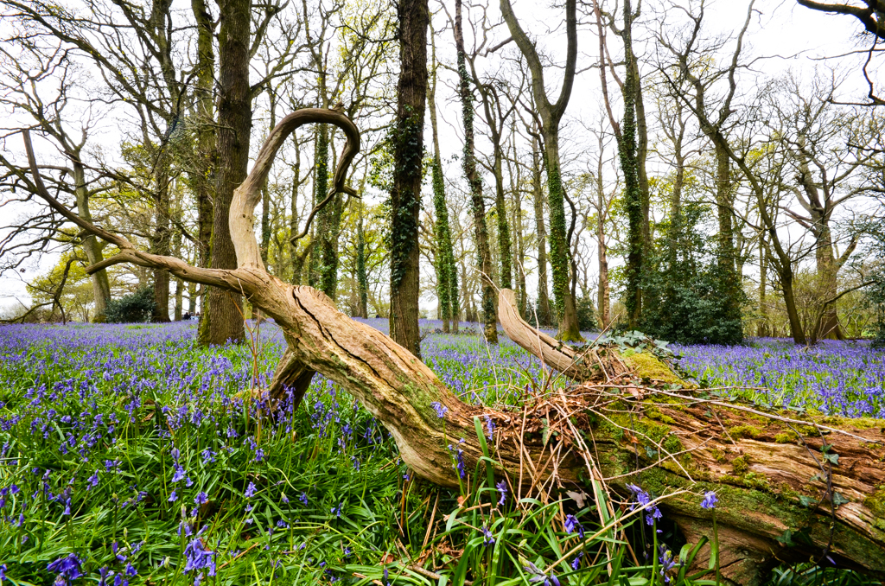

The days are getting slightly longer now but the cold lingers on, so it is fun to rewind through my archives for some photos of Spring. I know it is a bit mean of me inclicting this on anyone right now, unless you live in the Southern hemisphere of course.

The location in this photo was in the heart of Dorset just about a mile away from the National Trust property, Kingston Lacey. It is well worth a visit because it is quite big and it's just such a beautiful woodland. 

Photographers take note - Go early because the light is great at that time of day but also you will avoid the crowds that descend upon this ancient woodland in early May. I know all too well because I can remember setting up the camera and tripod only to find a small child peering into my lens and trampling all over my scene in the process. 

Parents should know better than to lr their toddlers run riot in such places!!!!