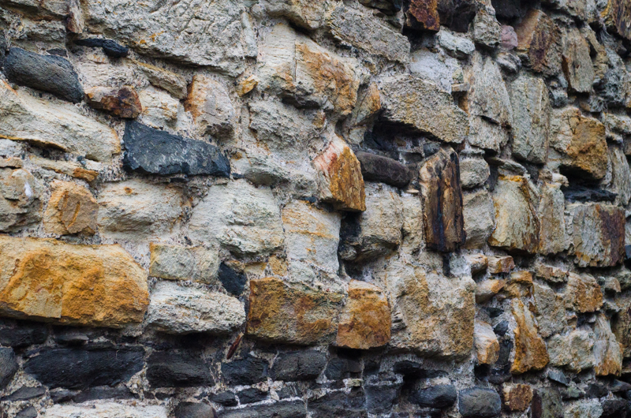
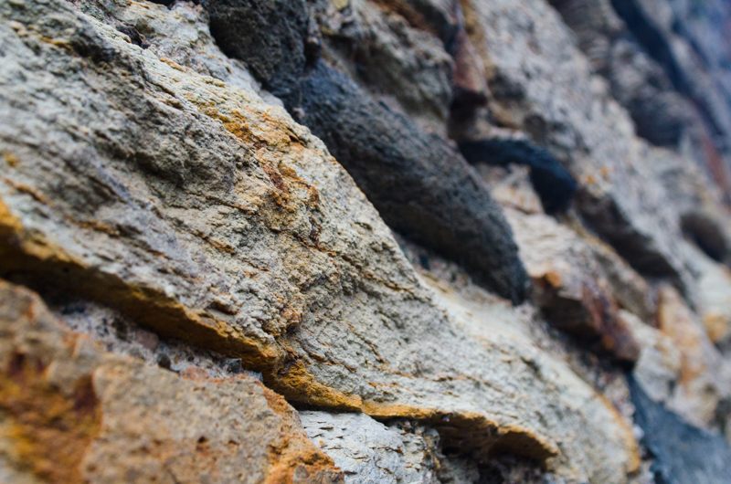
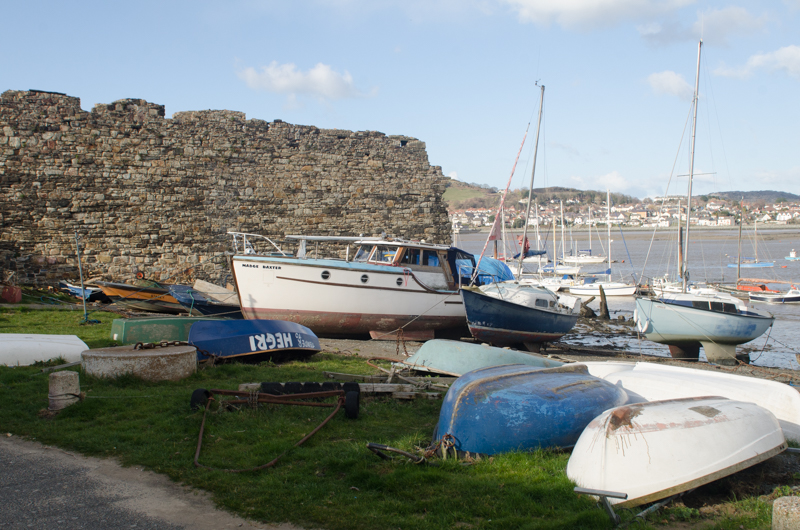
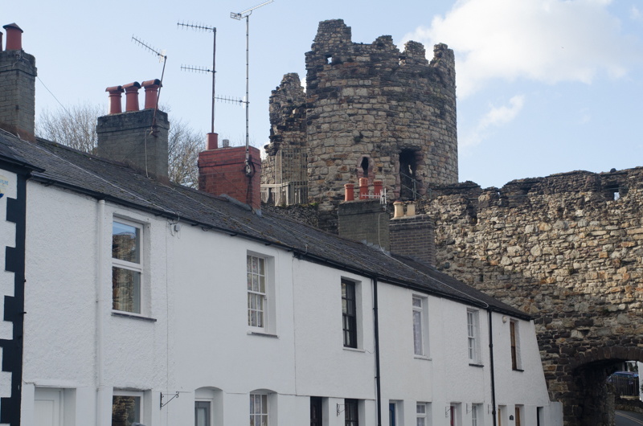
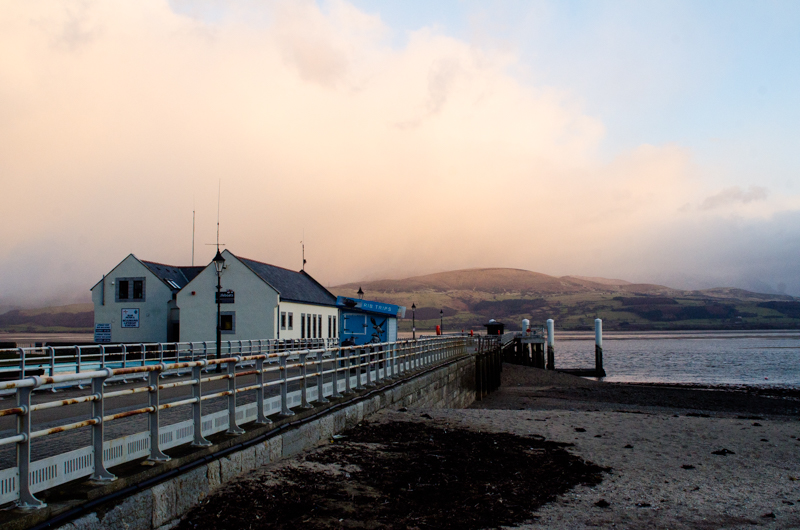

My Wife and our friends are all involved with the local Scout Group here in Farnborough and every year they take them on a summer camp and have been to various locations. This year they will be camping in Snowdonia. So we (several of us) decided to book a weekend up there towards the end of last year which just so happened to be yesterday!

The weather was very interesting with a mixture of wind, snow, hail, brilliant sunshine but mostly it was curiously dry.

**The Town Wall** - The town of Conwy's medieval walls were built between 1283 and 1287 as a defensive structure around the town after the town's foundation by King Edward I. 

**Close up detail of the stonework** - The very fact that this wall is as old as it is and has stood the test of time, is proof these structures were built to last.

**The River Conwy** - We followed the wall down to the riverside where the wind was bracing but the light was fantastic for photography!

**Town and the wall** - Looking back over my shoulder to take in the pretty cottages and the defensive wall that has kept them safe for many years. Mind you I would guess the cottages were built much much later, probably in the 1800s.

**Beaumaris Pier** - I wasn't able to get many more photographs but this was my favourite from the trip for many reasons. I hadn't been to Anglesey since 1981/1982 but the rest of our travelling companions were eager to take the short drive from Conwy, across Thomas Telford's splendid [Menai Bridge](http://menaibridges.co.uk/) onto the island. 

It was for me one of the highlights of the day. Beaumaris is a pretty place but we were wearing thermals, ski jackets, fleeces, scarves, woolly hats, ski gloves, walking boots and many other layers. That wind was brutal and shortly after taking this photo, it began to hail and snow! In fact you can see the storm front gathering and moments before, glorious sunlight highlighted the snowcapped peaks of Snowdon on the horizon. Sadly it vanished under a veil of cloud just in time for this photo!

We did stop for awhile at the [George and Dragon](https://www.robinsonsbrewery.com/georgedragonbeaumaris) in Beaumaris for some hot drinks. It was a fabulous Pub which must have been udated quite recently but still maintained it's old charm and character. In fact I later read on their [website](https://www.robinsonsbrewery.com/georgedragonbeaumaris) that it dates back to the 1400s making it one of the oldest Pubs in the whole of Wales.

Afterwards we travelled back onto the mainland and drove into the mountains. It was getting dark and the weather was punishing, so we took it all in from the comfort of our friend's car. It took us a further hour and a half to get back to our hotel in Oswestry, just as the weather was getting really nasty.

More photography planned for the Summer in the Snowdonia area.

